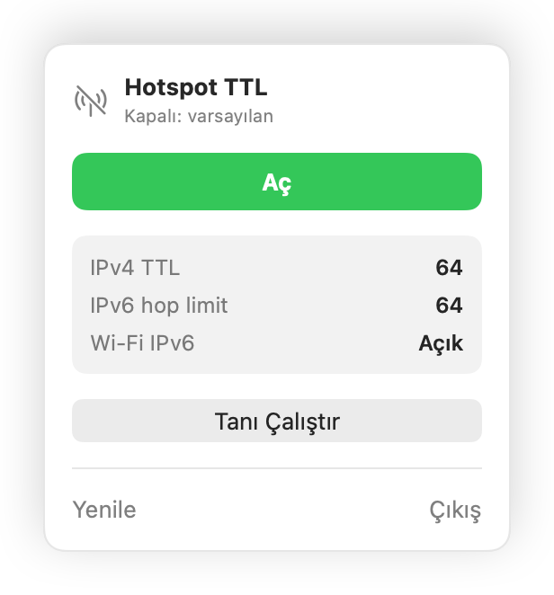
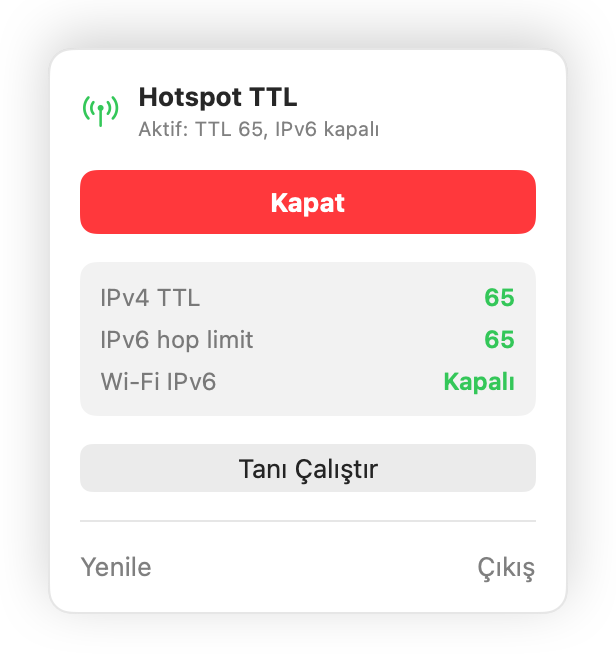
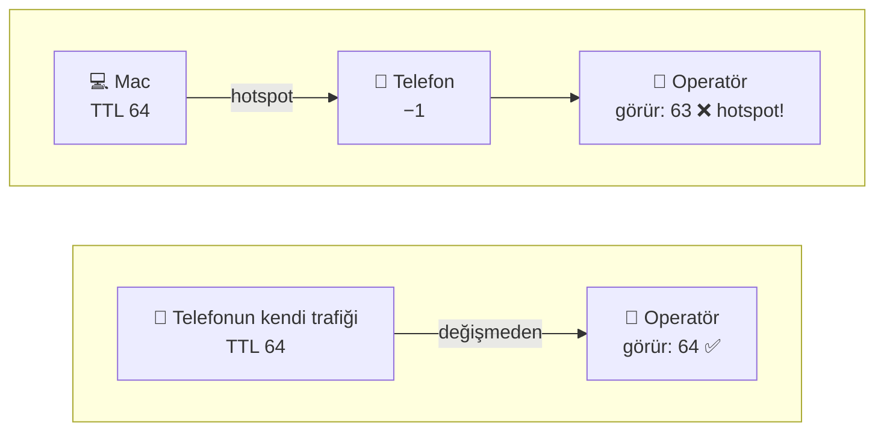
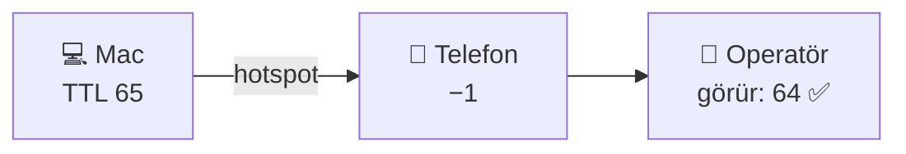
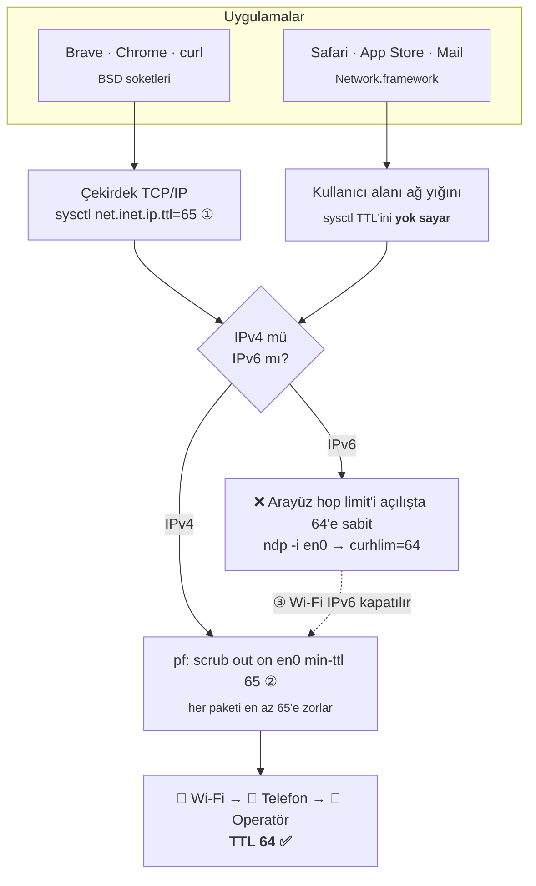
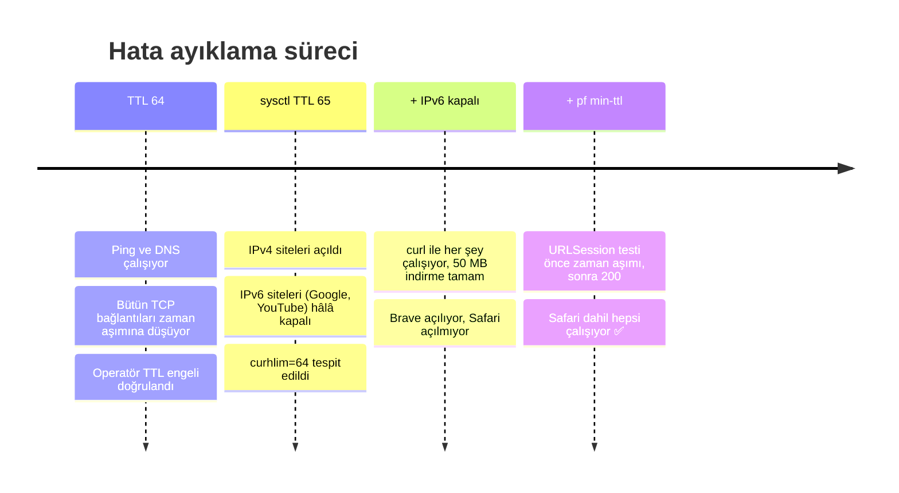

<h1 align="center">📡 Hotspot TTL</h1>

<p align="center">
  Telefon hotspot'una bağlıyken Mac trafiğini telefonun kendi trafiği gibi gösteren, menü çubuğunda duran tek tıklık bir macOS uygulaması.
</p>

<p align="center">
  
  
  
</p>

<p align="center">
  <picture>
    <source media="(prefers-color-scheme: dark)" srcset="docs/panel-off-dark.png">
    
  </picture>
  &nbsp;&nbsp;
  <picture>
    <source media="(prefers-color-scheme: dark)" srcset="docs/panel-on-dark.png">
    
  </picture>
</p>

---

## İçindekiler

- [Sorun](#sorun)
- [Çözüm: Aç düğmesi ne yapıyor?](#çözüm-aç-düğmesi-ne-yapıyor)
- [Kurulum](#kurulum)
- [Kullanım](#kullanım)
- [Tanı aracı](#tanı-aracı)
- [Nasıl bulundu?](#nasıl-bulundu)
- [Proje yapısı](#proje-yapısı)
- [Sınırlar](#sınırlar)

## Sorun

Her IP paketinde bir **TTL** (Time To Live) sayacı vardır. Paket bir yönlendiriciden geçtiğinde bu sayı 1 azalır. Telefonlar paketleri `TTL=64` ile gönderir. Hotspot'a bağlı bir bilgisayar da 64 ile gönderir, ama telefon bu paketleri yönlendirirken sayı 1 azalır. Operatör böylece iki farklı değer görür:



Operatör `63` gördüğü bağlantıları hotspot sayıp engelleyebilir. Bu durumda ping ve DNS çalışır ama web sayfaları açılmaz.

Mac paketleri **65** ile gönderirse telefondan çıkışta değer 64 olur ve trafik telefonun kendi trafiğinden ayırt edilemez:



## Çözüm: Aç düğmesi ne yapıyor?

Linux'ta bunun için tek bir `sysctl` ayarı yetiyor:

```ini
net.ipv4.ip_default_ttl=65
net.ipv6.conf.all.hop_limit=65
```

**macOS'ta tek ayar yetmiyor.** Farklı uygulamalar paketleri farklı yollardan oluşturuyor ve her yol ayrı bir düzeltme gerektiriyor:



| # | Adım | Komut | Neden gerekli |
|:-:|------|-------|---------------|
| ① | Çekirdek TTL | `sysctl -w net.inet.ip.ttl=65 net.inet6.ip6.hlim=65` | Brave, Chrome, curl gibi klasik soket kullanan uygulamalar için |
| ② | pf kuralı | `scrub out on en0 all min-ttl 65` | Safari ve Network.framework kullanan uygulamalar paketleri kullanıcı alanında oluşturuyor ve `sysctl` değerini kullanmıyor |
| ③ | IPv6 kapatma | `networksetup -setv6off Wi-Fi` | macOS IPv6 bağlantılarında arayüzün açılışta sabitlenen hop limit'ini (64) kullanıyor, bu değer sonradan değiştirilemiyor |

**Kapat** düğmesi üç adımı da geri alır: TTL 64'e döner, pf anchor'ı (`com.apple/250.HotspotTTL`) temizlenir, IPv6 "Otomatik"e döner. Sistemin kendi pf kurallarına dokunulmaz.

## Kurulum

Gereksinimler: **macOS 13+** ve **Xcode Command Line Tools**. Xcode'un kendisine gerek yok.

```bash
xcode-select --install                      # yoksa
git clone https://github.com/SerhanEnsar/HotspotTTL.git
cd HotspotTTL
./build.sh --install                        # derler ve /Applications'a kopyalar
open /Applications/HotspotTTL.app
```

`./build.sh` tek başına çalıştırılırsa sadece proje klasöründe `HotspotTTL.app` oluşturur.

> Açılışta kendiliğinden başlasın istersen: **Sistem Ayarları → Genel → Giriş Öğeleri** bölümüne `HotspotTTL.app`'i ekle.

## Kullanım

1. Telefonun hotspot'una bağlan.
2. Menü çubuğundaki **📡 anten** ikonuna tıkla ve **Aç**'a bas. macOS yönetici şifresini ya da Touch ID'yi ister.
3. Safari açıksa **⌘Q** ile kapatıp yeniden aç, çünkü ağ değişikliğini fark etmesi gerekiyor.
4. Hotspot'tan ayrılınca **Kapat**'a bas. Yoksa diğer Wi-Fi ağlarında IPv6 kapalı kalır.

| Durum | Menü çubuğu ikonu |
|-------|-------------------|
| Kapalı | `antenna.radiowaves.left.and.right.slash` |
| Açık | `antenna.radiowaves.left.and.right` |

> Ayarlar **kalıcı değildir**. Mac yeniden başlayınca hepsi varsayılana döner. Bu bilerek böyle yapıldı: hotspot kullanmadığın zamanlarda sistem normal çalışır.

## Tanı aracı

Hotspot'ta internet yokken yardım istemek zordur. **Tanı Çalıştır** düğmesi internete ihtiyaç duymadan bir rapor hazırlar ve `~/Desktop/HotspotTTL-rapor-<tarih>.txt` dosyasına yazar. Terminalden `./diagnose.sh` ile de çalıştırılabilir. Yaklaşık 1 dakika sürer.

| Bölüm | Neyi gösterir |
|-------|---------------|
| TTL | `sysctl` değerleri, arayüz `curhlim`, Wi-Fi IPv6 durumu |
| Network.framework testi | Safari'nin kullandığı yığın bağlantı kurabiliyor mu |
| Ağ / DHCP | Ağ geçidi, telefon türü (ör. `ANDROID_METERED`) |
| Ping / Traceroute | Bağlantı IP seviyesinde var mı, nerede kesiliyor |
| DNS | Sistem DNS'i ve `1.1.1.1` ayrı ayrı |
| HTTP / HTTPS | Google, YouTube, GitHub; IPv4 ve IPv6 zorlanarak ayrı ayrı |
| Claude / UDP | claude.ai, API ve QUIC yolu |
| Hız | 2 MB kısa test ve 20 saniyelik kesintisiz indirme (geç devreye giren engeli yakalar) |

**İpucu:** Biri mod **kapalıyken**, biri **açıkken** olmak üzere iki rapor al ve karşılaştır.

## Nasıl bulundu?

Uygulama, gerçek bir Vodafone hattında ve Samsung Android hotspot'unda tanı raporlarıyla adım adım geliştirildi:



## Proje yapısı

```
HotspotTTL/
├── Sources/main.swift   # SwiftUI MenuBarExtra: panel, sysctl/pf/networksetup çağrıları
├── Info.plist           # LSUIElement: Dock'ta görünmez
├── build.sh             # swiftc ile derleme ve ad-hoc imzalama (Xcode projesi yok)
├── diagnose.sh          # internet gerektirmeyen tanı raporu
├── Tools/
│   ├── render.swift     # README ekran görüntülerini üretir
│   └── render.sh
└── docs/                # panel görselleri (açık/koyu tema)
```

- **Tek dosya, bağımlılık yok.** `swiftc` ile doğrudan derleniyor.
- **Yetki:** root yetkisiyle çalışan ayrı bir yardımcı süreç ya da daemon yok. Her değişiklikte `NSAppleScript` üzerinden `do shell script … with administrator privileges` çağrılıyor ve macOS kendi şifre penceresini gösteriyor.
- **Okuma** (`sysctl -n`, `networksetup -getinfo`) yetki istemiyor. Panel her açıldığında durumu yeniliyor.

README görsellerini yeniden üretmek için:

```bash
./Tools/render.sh
```

## Sınırlar

- **TTL tek tespit yöntemi değildir.** Operatör trafiğin içeriğine de bakabilir (DPI): işletim sistemi güncelleme sunucuları, User-Agent vb.
- **Ayrı hotspot APN'i:** operatör hotspot trafiğini farklı bir APN'den geçiriyorsa bu ayarlar işe yaramaz.
- **Sadece Wi-Fi (`en0`):** USB ya da Bluetooth ile paylaşım için pf kuralında arayüz adı değiştirilmeli.
- **IPv6** mod açıkken tamamen kapalıdır, bütün trafik IPv4'ten gider.
- Hat tarifenizin hotspot koşullarını kontrol edin. Kullanım sorumluluğu size aittir.
